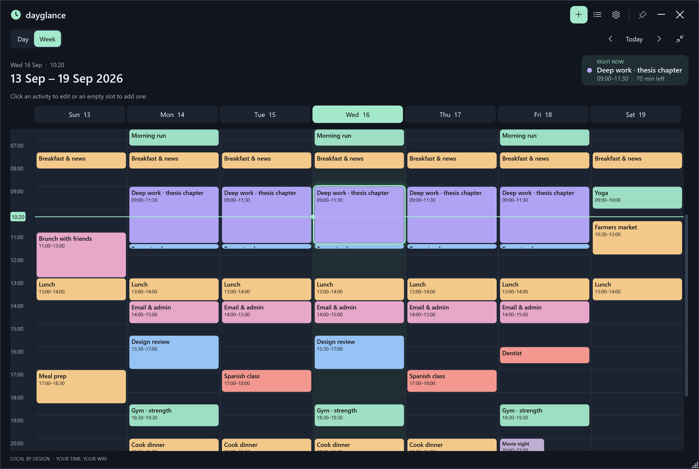
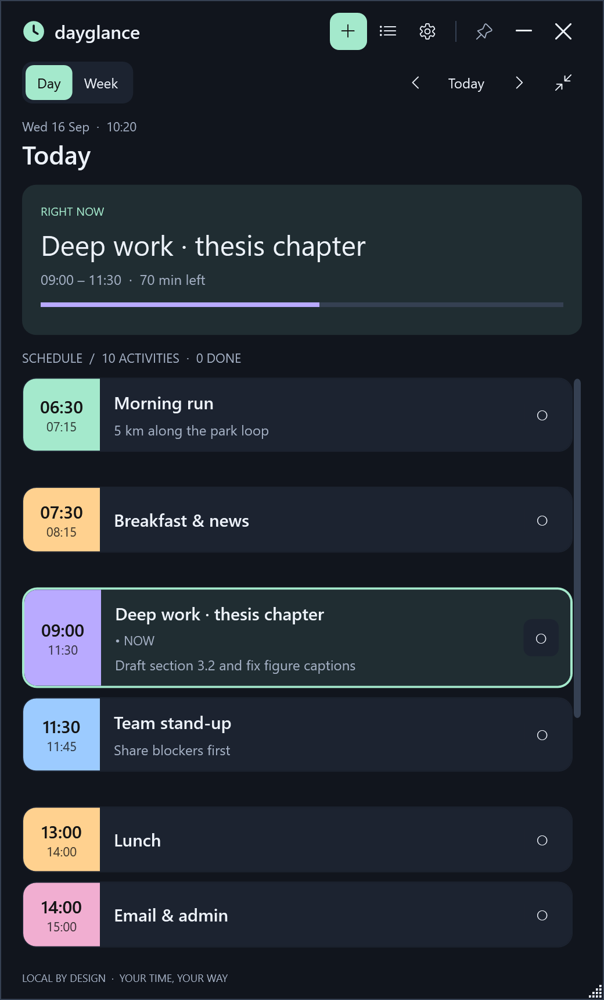
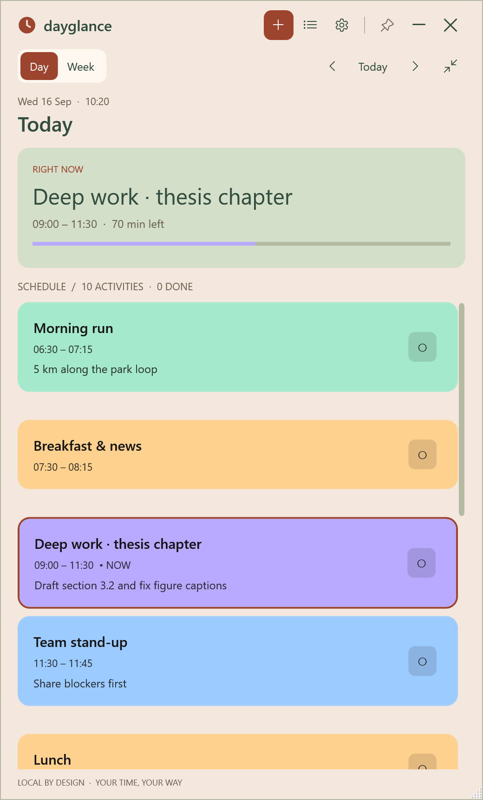
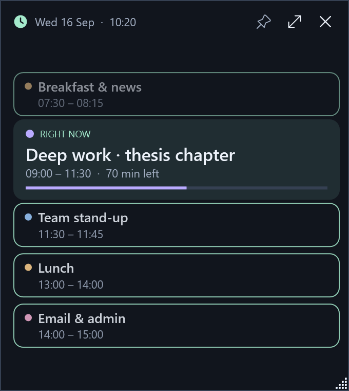
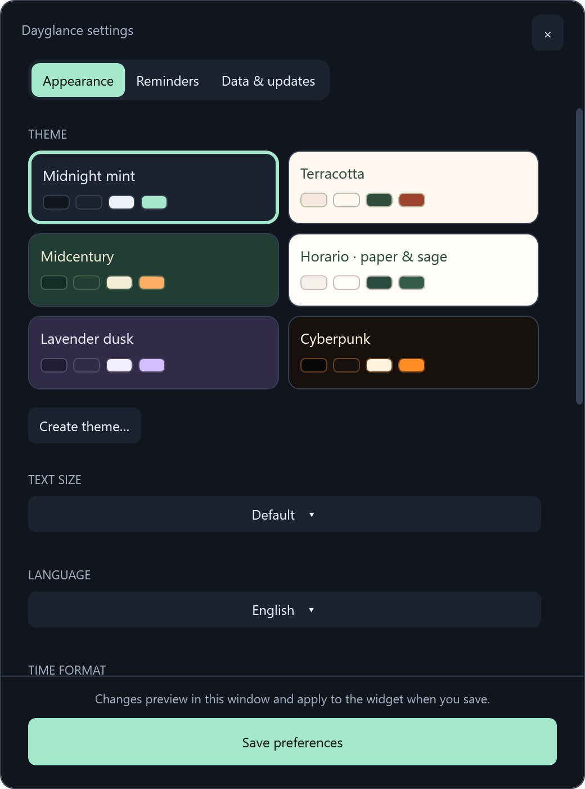
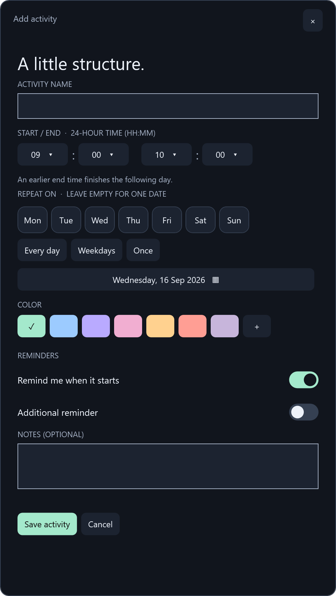
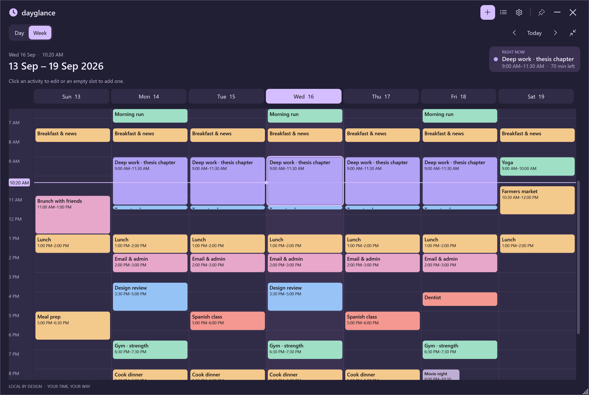

# Dayglance

A free, local Windows schedule widget. English and Spanish. Full source under the MIT license. No account, payment, or telemetry; the only network request is the optional update check against this repository's GitHub releases.

<table>
<tr>
<td align="center"> Day view · Midnight mint</td>
<td align="center"> Full-color cards · Terracotta</td>
<td align="center"> Mini widget</td>
</tr>
<tr>
<td align="center"> Settings</td>
<td align="center"> Activity editor</td>
<td align="center"> Lavender dusk · 12-hour clock</td>
</tr>
</table>

Screenshots use the fictional schedule in <code>docs/sample-schedule.json</code>.

## Install

1. Download the latest `Dayglance-<version>.zip` from the repository's **Releases** page.
2. Extract it into a permanent folder you can write to (for example `Documents\Dayglance`) and run **Dayglance.exe**.
3. Your schedule and settings live in `%LOCALAPPDATA%\Dayglance`, separate from the app folder.

Requires Windows 10/11 with .NET Framework 4.8. No installer or administrator rights. The executable is unsigned, so Windows SmartScreen may ask for confirmation the first time.

## Updates

- Dayglance checks GitHub for a newer release shortly after starting and every few hours (turn this off in **Settings → Data & updates**). When one is available, a small card offers to install it; you can also use **Check now** there.
- Installing downloads the release ZIP, closes Dayglance, replaces the previous app files (tracked in `dayglance-files.txt`), and reopens it. Your schedule is never touched. If anything fails, the previous files are restored and details go to `%LOCALAPPDATA%\Dayglance\update.log`.
- Manual update: quit from the tray icon (**Quit / Salir**), extract the new ZIP over the old folder and run it again.
- If sign-in startup was enabled and you moved the app folder, save preferences once so the shortcut points to the new location.

## Views and controls

- The title bar holds **add**, **manage**, **settings**, **pin**, minimize and hide-to-tray. Hover for labels. Drag the title bar to move the widget; double-click it to switch to the mini widget.
- Below it, the **Day / Week** switch sits on the left; previous / **Today** / next and the **mini widget** button sit on the right.
- The **mini widget** is a small window with the current (or next) activity and its progress. Make it taller to also see the previous and upcoming activities (outlined cards); with room for only one card it shows what comes next as a line of text. Hover any card for **Edit**; click a card to open the schedule at that activity, or use the expand button. Switching between day and week morphs the focused day's column while the other days slide in or out; switching modes fades smoothly, and when a new activity starts its card slides in and pulses. The mini widget and the full schedule each remember their own size and position, including across restarts and monitors.
- Day and week views **share one window size**, and switching views never resizes the window. Drag any edge or corner to resize.
- The week view shrinks to **3–7 day columns**. With fewer than seven it scrolls horizontally (Shift + wheel, or wheel over the day headings) and keeps today centered while you resize.
- **Ctrl + mouse wheel** over the schedule zooms.
- Week view highlights today and shows a live time line. Click a day heading for its day view, an activity to edit it, or an empty slot to add a one-hour activity starting at that hour. **Today** re-centers the week on today.
- **Settings → Current activity in week view** shows the running activity with the time line and dot, an accent outline, or a pulsing accent glow.
- The running activity is always outlined in the accent color. Click the **Right now** card (or the upcoming-activity card) to scroll to it; it lands first, or second when its neighbors also fit, pulses briefly and the other cards dim during the pulse.
- Week view shows a compact **Right now / Up next** card beside the week range. Clicking it scrolls to the activity, pulses its glow and briefly dims everything else in the week.
- In day view, hover the space between two activities with free time to reveal **+ start – end**; click to add a one-hour activity at the start of that gap (shorter if the gap is shorter).
- **Back / forward:** after jumping between views or days (day headings, Day/Week, Today), use the mouse back/forward buttons or Alt + ← / →.
- Settings, Manage and the activity editor close without saving when you click the widget behind them. The **Save preferences** button sits at the bottom of Settings.
- **Settings → Activity cards** picks a slim color line, a color band with times, or a full-color card for the day view.
- Day view always highlights the actual current activity. The circle button marks that occurrence done; click again to undo.

## Activities

Choose start/end hours and minutes from menus. Minutes use five-minute intervals; imported nonstandard minutes are preserved as extra choices. An earlier end means the next day. Equal start/end times are rejected.

Pick a color from the presets and every color already in your schedule, or use **+** to open the color picker for a custom color.

Select repeat-day pills or Every day, Weekdays, or Once. The custom calendar is enabled for one-time activities. Editing a repeating activity changes its whole series, including past views. Single-occurrence overrides are not supported.

## Themes and language

Open **Settings / Ajustes**. Its tabs group **Appearance** (theme, text size, language), **Schedule** (12- or 24-hour time, card style, current-activity highlight), **Reminders** (reminders, sound, startup) and **Data** (import/export). The settings window previews your choices, including **Test reminder**, and the widget changes only when you save preferences. Closing without saving discards the preview.

- **Midnight mint:** charcoal and mint.
- **Terracotta:** clay, cream, and soft greens.
- **Midcentury:** dark green and orange.
- **Horario · paper & sage:** paper, sage, and pink, inspired by the image.
- **Lavender dusk:** deep purple and lavender.
- **Cyberpunk:** near-black and orange.

**Create theme / Crear tema** edits four colors with a color picker: **background, cards, text and accent**. Highlight, secondary text and lines are derived from them. The creator offers palette ideas, **Surprise me**, per-color **Suggest** links, accent suggestions, a live mini-widget preview and contrast ratings. *Match cards and text to the background* keeps those two in step while you explore. Select a custom theme to **Edit** or **Delete** it. Up to 24 custom themes are supported. Activity colors remain independent of interface themes.

## Reminders

- **Remind me when it starts** sends a reminder at the activity's start time.
- **Additional reminder** adds one earlier reminder, set as any mix of days, hours and minutes before the start (1 minute to 30 days).
- Older schedules that used "N minutes before" are converted automatically: the reminder moves to the additional reminder and the main one fires at the start.
- Settings controls global reminders and sound. **Test reminder / Probar aviso** uses the currently applied theme and the sound switch's current setting.
- Notifications are small Dayglance cards showing the activity, its start and end time and any notes, with an optional two-note chime. Click anywhere on a card to open the app, or × to dismiss; they close by themselves after 18 seconds.
- Keep the app running, including in the tray. Checks run approximately every 10 seconds. Missed primary reminders catch up while the activity remains active. Extra advance reminders have a 15-minute catch-up window and expire at the activity's start. Completed occurrences do not remind. Saved history prevents duplicates after restart.
- Custom popups are not saved in Windows Notification Center and do not automatically follow Windows Do Not Disturb. Disable reminders in the app when needed. Sound also depends on Windows volume/output settings.

## Import, export, and sharing

Use **Settings → Import / Ajustes → Importar** for schedule JSON. Import confirms replacement and saves a timestamped backup first. Local theme, language, notification, and view settings are preserved. Custom themes from the file merge by ID. Export includes activities, notes, completion/reminder history, and custom themes.

The personal `Horario-2027-1.json` is supplied separately, not embedded in releases. Select **Español**, **Horario · paper & sage**, and **Week / Semana** for the image-inspired view. Its activity reminders are off for testing.

Share the release link or ZIP with friends: it contains no personal schedule data. Each person has separate local storage. Send exported JSON separately only when you want to share its contents.

Each successful save retains the previous file as `schedule.json.bak`. If data is unreadable, the app leaves it untouched. Quit, preserve the damaged file, and restore the `.bak` as `schedule.json` if needed.

## Inicio rápido en español

1. Cierra la versión anterior desde su icono de bandeja → **Salir**.
2. Descarga el ZIP más reciente desde **Releases**, extráelo en una carpeta permanente y abre **Dayglance.exe**. Se conserva tu horario local; las actualizaciones se instalan desde la propia app.
3. Pulsa **⚙**, elige **Español**, selecciona un tema y guarda las preferencias.
4. En **Ajustes → Importar**, abre **Horario-2027-1.json**. Confirma el reemplazo; antes se guardará un respaldo.
5. Selecciona **Semana**. El botón de mini widget alterna la vista reducida; **Ctrl + rueda** cambia el zoom.
6. Pulsa **+** para añadir actividades. Los avisos funcionan mientras la app siga abierta, incluso en la bandeja.

## Source, builds and releases

`source/Build.ps1` compiles every `.cs` file in `source` with the Windows .NET Framework compiler (no NuGet packages). `-OutputDirectory` writes the build elsewhere; by default it goes to `source\Dayglance.exe`. `MakeIcon.ps1` regenerates the icon.

- `Dayglance.exe --self-test`: schedule, reminder, validation, palette, clock format, release-version and persistence checks.
- `Dayglance.exe --ui-test`: controls, editor, themes and theme creator, Spanish, window sizing, mini widget, narrow week scrolling, backup and notifications.
- `Dayglance.exe --showcase <schedule.json>`: rendering checks across all six themes, with screenshots beside the executable.
- `Dayglance.exe --screenshots docs\sample-schedule.json docs\screenshots`: regenerates the README screenshots from the sample schedule at a fixed date and time (run from the repository root).

Results go to `test-results.txt`, `ui-test-results.txt` and `showcase-results.txt`; tests use isolated data folders.

### Publishing a release

1. Bump `Version` in `source/Version.cs` (e.g. `2.1.1`) and commit on `main`.
2. Tag and push: `git tag v2.1.1` then `git push origin main v2.1.1`.
3. The **Release** GitHub Actions workflow builds on Windows, runs the self-test, and publishes `Dayglance-2.1.1.zip` to Releases. Installed copies pick it up automatically.

`source/Package.ps1` produces the same ZIP locally in `dist\`.
